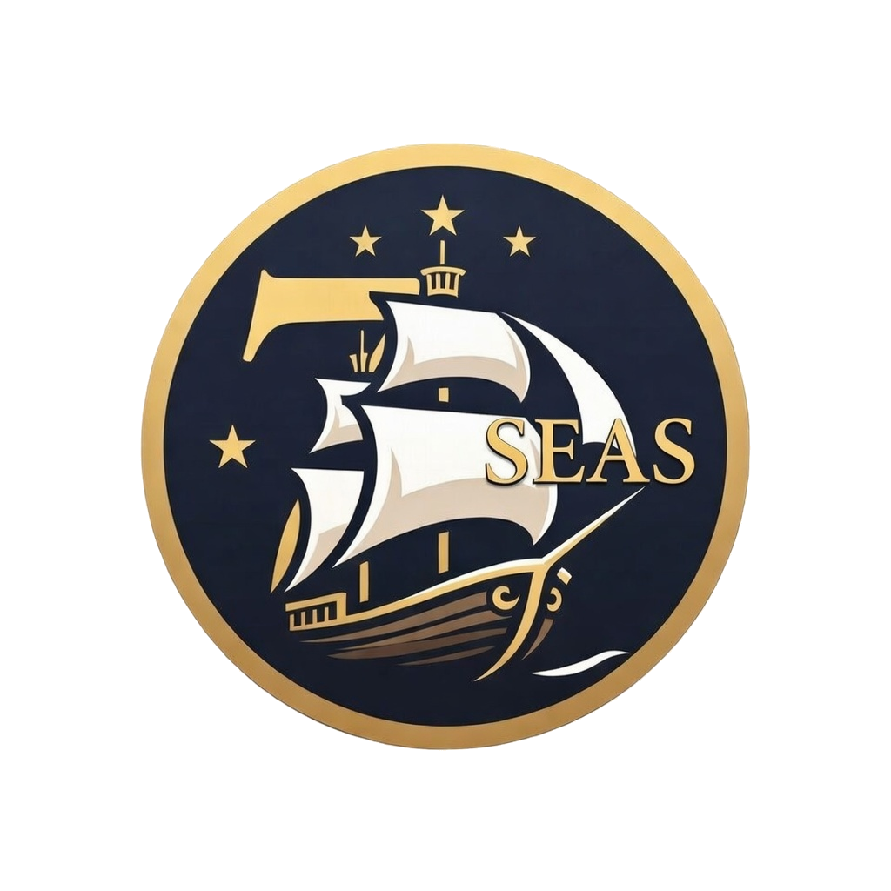
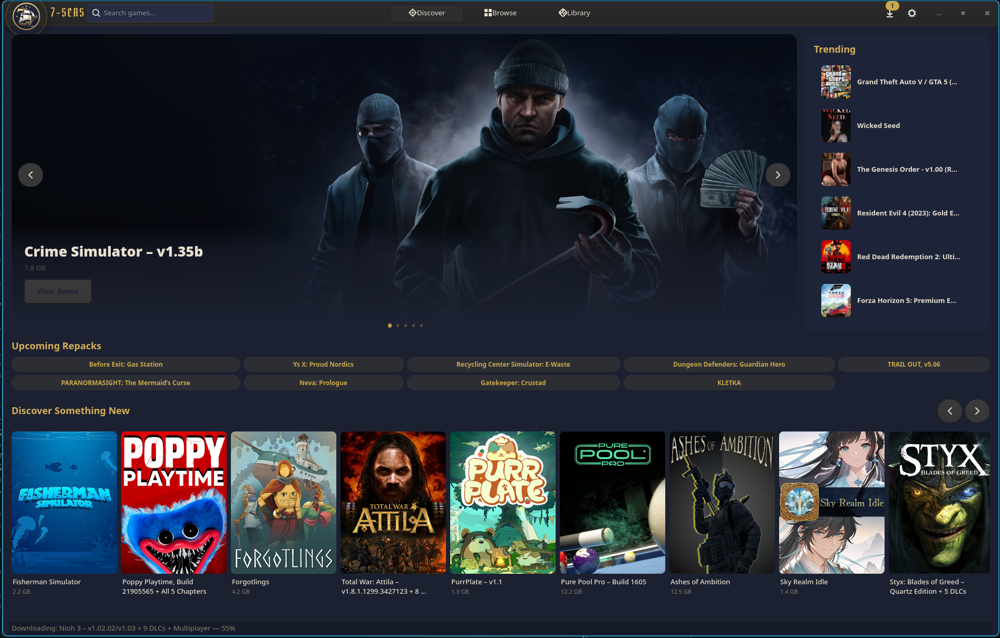
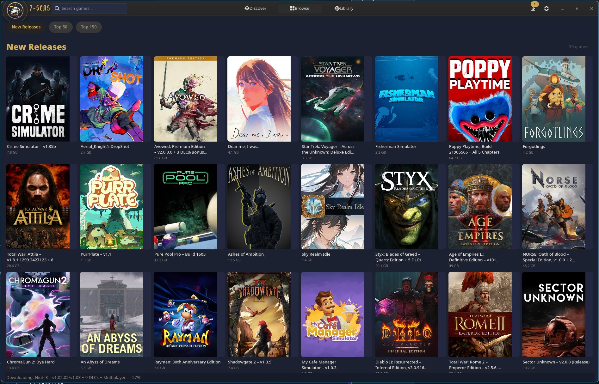
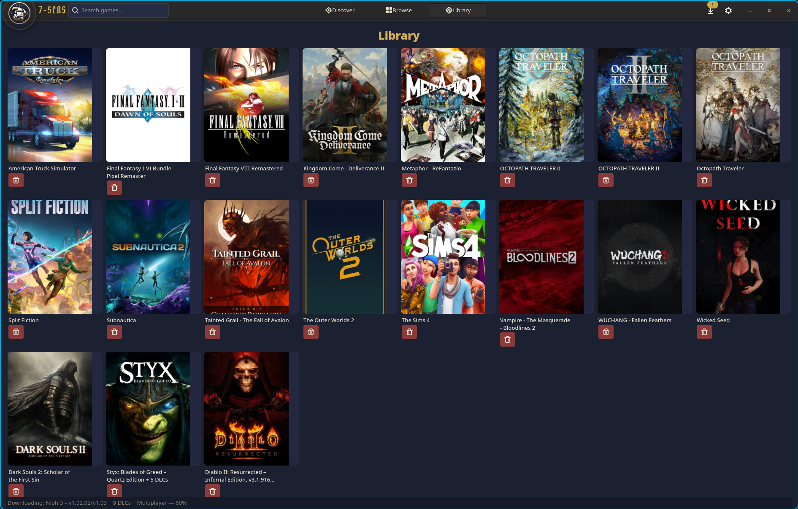

<p align="center">
  
</p>

<h1 align="center">7-Seas Launcher</h1>

<p align="center">
  A Linux desktop app for downloading game repacks, installing them through Wine, and automatically adding them to Steam &mdash; artwork and all.
</p>

<p align="center">
  Built with <strong>GTK4 + Libadwaita</strong> &bull; Nautical theme &bull; Arch Linux focused
</p>

---

## Screenshots

### Discover
Featured games, trending titles, upcoming repacks, and new releases all in one view.



### Browse
Browse New Releases, Top 50, and Top 150 repacks with cover art pulled from SteamGridDB.



### Library
Your installed games at a glance with cover art, launch support, and Steam integration status.



---

## What It Does

7-Seas automates the entire repack-to-Steam pipeline on Linux:

1. **Browse & Search** &mdash; Scrapes FitGirl Repacks for game listings, cover art, descriptions, system requirements, and screenshots
2. **Download** &mdash; Sends the magnet link to [Torbox](https://torbox.app/) debrid, then streams the finished torrent down from their CDN
3. **Extract** &mdash; Unpacks archives with `7z`
4. **Install** &mdash; Runs the setup executable through a [Bottles](https://usebottles.com/) Wine prefix with automatic retry support for integrity check mismatches
5. **Organize** &mdash; Moves the installed game to `~/Games/`
6. **Steam Integration** &mdash; Creates a non-Steam shortcut, configures Proton, installs common redistributables (VC++), downloads artwork from [SteamGridDB](https://www.steamgriddb.com/), and restarts Steam

All pipeline steps run in the background. Closing the window hides to the system tray &mdash; downloads keep going.

---

## Features

- **One-click install** &mdash; Click Install on any game and the entire pipeline runs automatically
- **Download queue** &mdash; Sequential downloads with progress tracking, speed display, and cancel/retry buttons
- **Installer retry** &mdash; Re-run FitGirl setup if integrity checks fail, without restarting the whole pipeline
- **Steam artwork** &mdash; Grid, hero, logo, and icon art fetched from SteamGridDB and placed in the correct directories
- **Proton auto-config** &mdash; Automatically sets Proton for every game with engine-specific DLL overrides (Unity, Unreal)
- **Smart exe detection** &mdash; Scores executables by file size, directory depth, and name patterns to find the real game binary
- **System tray** &mdash; Minimizes to tray on close, continues downloads in background, desktop notifications on completion
- **Nautical theme** &mdash; Navy background, gold accents, Pirata One font

---

## Installation

### Requirements

**System packages:**

| Package | Purpose |
|---|---|
| `python` >= 3.12 | Runtime |
| `gtk4`, `libadwaita` | UI framework |
| `p7zip` | Archive extraction |
| `bottles` (native or Flatpak) | Wine prefix management |
| `steam` | Game library integration |
| `libayatana-appindicator` | System tray icon |

**Python packages** (installed automatically):

- `PyGObject` >= 3.46
- `httpx` >= 0.27
- `beautifulsoup4` >= 4.12
- `lxml` >= 5.0
- `vdf` >= 3.4
- `torbox-api` >= 0.1.0

### Setup

```bash
git clone https://github.com/alborlin/7seas-launcher.git
cd 7seas-launcher
pip install -e .
```

### Run

```bash
seven-seas
```

On first launch you'll be prompted to enter your **Torbox API key** in Settings. Optionally add a **SteamGridDB API key** for automatic artwork.

---

## Configuration

All settings are accessible from the Settings page in the app:

| Setting | Default | Description |
|---|---|---|
| Torbox API Key | *(required)* | Your [Torbox](https://torbox.app/) debrid API key |
| SteamGridDB API Key | *(optional)* | [SteamGridDB](https://www.steamgriddb.com/preferences/api) key for artwork |
| Games Directory | `~/Games` | Where installed games are stored |
| Proton Version | `proton_experimental` | Which Proton to use for all games |
| Auto-add to Steam | `true` | Automatically create non-Steam shortcuts |

---

## How the Pipeline Works

```
User clicks Install
        |
        v
Scraper fetches magnet URI from repack page
        |
        v
Torbox cloud seeds the torrent (poll every 3s)
        |
        v
Stream .zip from Torbox CDN to ~/.cache/seven-seas/
        |
        v
7z extract to temp directory
        |
        v
Bottles runs setup.exe in Wine prefix (with retry loop)
        |
        v
Move installed game from Wine prefix to ~/Games/
        |
        v
Add Steam shortcut + set Proton + install redists
        |
        v
Fetch artwork from SteamGridDB (grid/hero/logo/icon)
        |
        v
Restart Steam to pick up new shortcut
```

Steam-related steps are non-fatal &mdash; if artwork fetch or shortcut creation fails, the game is still installed.

---

## File Locations

| What | Path |
|---|---|
| Database | `~/.local/share/seven-seas/sevenseas.db` |
| Log file | `~/.local/share/seven-seas/sevenseas.log` |
| Cover image cache | `~/.cache/seven-seas/covers/` |
| Download temp files | `~/.cache/seven-seas/` |
| Installed games | `~/Games/` (configurable) |

---

## Development

```bash
# Install dev dependencies
pip install -e ".[dev]"

# Run tests (all mocked, no network needed)
pytest tests/ -v
```

---

## License

Private project. All rights reserved.
